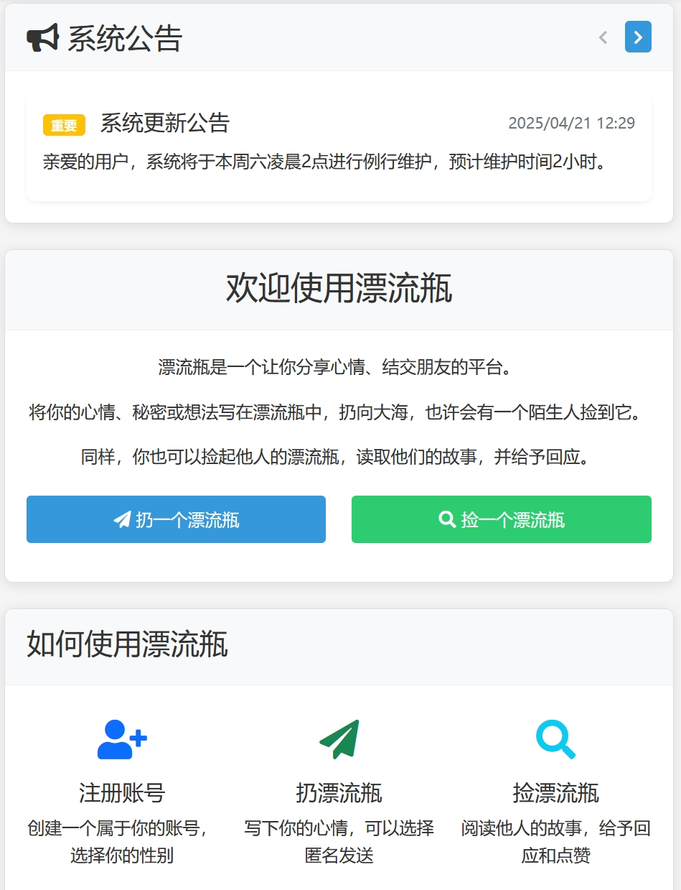
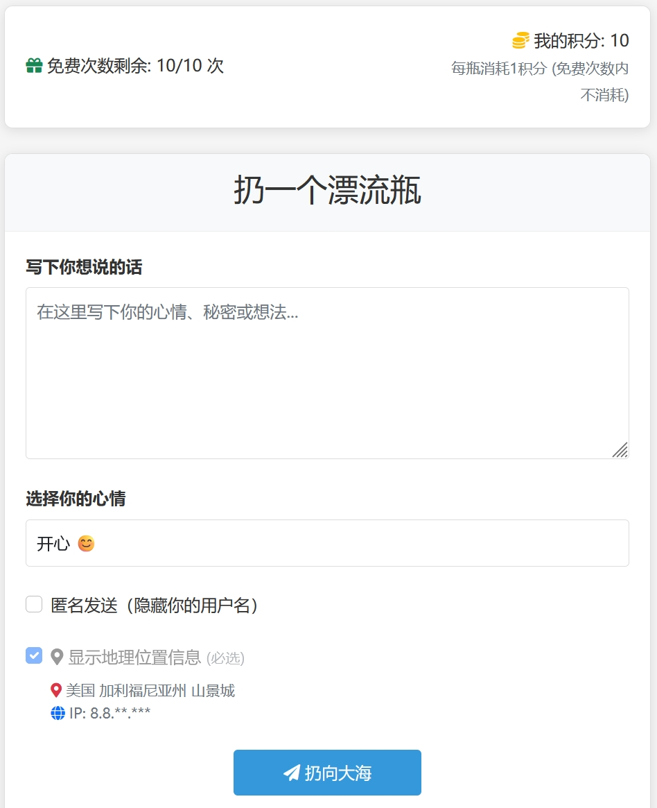
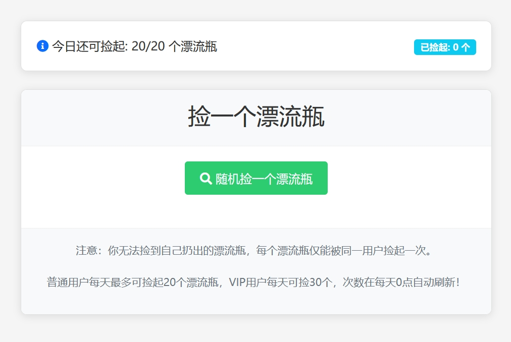
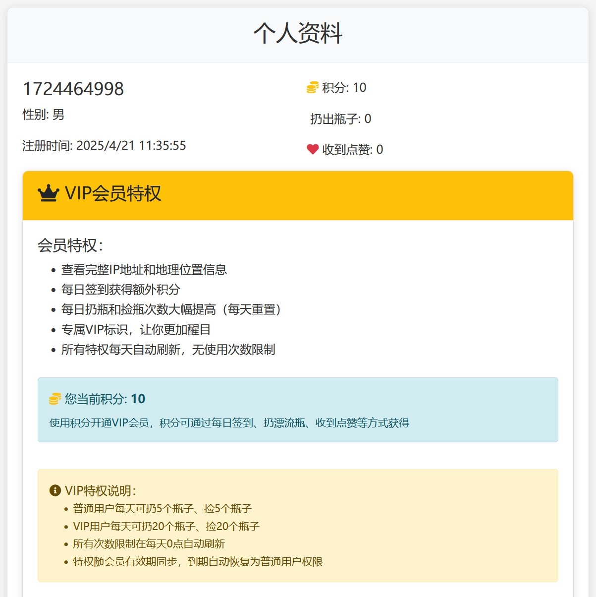

<div align="center">

# 🌊 Driftbottle - 数字海洋中的情感漂流瓶

> **一个现代化的匿名社交平台，让每一份心情都能在数字海洋中找到共鸣**

[](https://opensource.org/licenses/MIT)
[](https://www.php.net/)
[](https://www.mysql.com/)
[](https://github.com/kggzs/Driftbottle)
[](https://github.com/kggzs/Driftbottle)

[🚀 快速开始](#-安装与部署) • [📖 文档](docs/) • [🐛 问题反馈](https://github.com/kggzs/Driftbottle/issues) • [💬 讨论](https://github.com/kggzs/Driftbottle/discussions)

---

</div>

## 🎯 项目简介

**Driftbottle** 是一个基于 Web 技术的匿名社交漂流瓶系统，将传统的"漂流瓶"概念数字化，为用户提供一个安全、私密的情感分享平台。

### ✨ 核心特性

<div align="center">

| 🎨 用户体验 | 🔒 安全可靠 | 🚀 高性能 | 💎 丰富功能 |
|:---:|:---:|:---:|:---:|
| 现代化 UI 设计 | 多重安全防护 | 轻量级架构 | 语音漂流瓶 |
| 响应式布局 | XSS/SQL 注入防护 | 优化数据库查询 | 评论回复系统 |
| 流畅交互体验 | CSRF 令牌验证 | 缓存机制 | VIP 会员系统 |
| 个性化设置 | 会话安全保护 | 异步处理 | 用户等级系统 |
| 移动端优化 | 支付安全验证 | 高效订单处理 | 在线充值系统 |

</div>

### 🌟 为什么选择 Driftbottle？

- **🔐 隐私优先** - 支持匿名发送，IP 地址保护，VIP 用户完全隐藏
- **💬 深度互动** - 二级评论回复系统，让交流更有层次
- **🎤 多媒体支持** - 文字与语音双重表达方式，传递更丰富的情感
- **⚡ 轻量高效** - 纯 PHP + MySQL 架构，无需复杂依赖
- **🛡️ 安全可靠** - 多重安全机制，保护用户数据与隐私
- **📱 响应式设计** - 完美适配桌面端与移动端
- **🎯 用户成长** - 经验值等级系统，让每一次互动都有意义
- **💎 会员特权** - VIP 系统提供更多功能与权限
- **💰 在线充值** - 支持支付宝、微信支付等多种支付方式，便捷充值积分
- **📊 订单管理** - 完善的订单管理系统，支持订单查询、状态跟踪
- **🚨 内容审核** - 完善的举报系统，支持屏蔽、删除等操作，维护社区环境

---

## 🎨 系统概述

漂流瓶系统采用现代化的 Web 技术栈，构建了一个轻量级但功能丰富的社交平台。系统设计遵循**简洁、安全、高效**的原则，为用户提供流畅的交互体验。

### 设计理念

- **🌊 数字海洋** - 将互联网比作海洋，每个漂流瓶都是用户情感的载体
- **🔗 情感连接** - 通过随机匹配，让陌生人之间产生有意义的交流
- **🛡️ 隐私保护** - 在开放交流的同时，最大程度保护用户隐私
- **📈 持续成长** - 通过等级系统和积分机制，激励用户持续参与

### 技术亮点

- **前后端分离** - 清晰的 API 设计，便于扩展和维护
- **模块化架构** - 功能模块独立，易于定制和二次开发
- **安全第一** - 从输入验证到输出过滤，全方位安全防护
- **性能优化** - 数据库索引优化，查询性能提升

## 🚀 主要功能

### 👤 用户功能

- **注册与登录**：快速创建账户，安全登录。
- **个人资料**：管理个人信息，设置个性签名。
- **漂流瓶操作**：
    - **扔瓶子**：写下心情或想法，投入大海。
    - **语音漂流瓶**：🎤 录制语音消息，发布语音漂流瓶（支持录音、播放、时长显示）。
    - **捡瓶子**：随机捡起他人的漂流瓶（支持文字和语音两种类型）。
    - **互动**：评论、点赞漂流瓶，支持二级评论回复。
    - **记录**：查看自己扔出和捡到的瓶子（支持语音播放和评论查看）。
    - **评论管理**：评论后可以选择"仅评论"或"评论并丢回大海"。
- **性别标识**：男性漂流瓶 (蓝色 🔵)，女性漂流瓶 (粉色 🌸)。
- **匿名选项**：可选择匿名发送，保护隐私。

### 💎 高级功能

- **VIP 会员**：购买 VIP 享受更多特权（如：更多扔/捡瓶次数、专属标识）。
- **签到系统**：每日签到获取积分，连续签到有额外奖励。
- **积分系统**：通过多种方式赚取积分，兑换系统特权。
- **在线充值**：💰 支持支付宝、微信支付、QQ钱包、云闪付等多种支付方式，便捷充值积分。
- **充值记录**：查看个人充值历史记录，包括订单号、金额、积分、支付方式、状态等信息。
- **用户等级系统**：🎯 通过发漂流瓶、捡漂流瓶、评论等操作获得经验值，自动升级等级，在个人主页显示等级和经验条。
- **IP 保护**：VIP 用户 IP 地址完全隐藏，普通用户部分隐藏。
- **消息中心**：接收系统通知和互动消息，支持点击标记已读。

### 🛡️ 安全特性

- **防 XSS 攻击**：严格的输入过滤和内容安全策略 (CSP)。
- **防 SQL 注入**：使用参数化查询和输入验证。
- **防 CSRF 攻击**：实施 CSRF 令牌验证。
- **会话安全**：防止会话固定攻击。
- **数据验证**：前后端双重数据校验。

### ⚙️ 管理员功能

- **用户管理**：查看、封禁/解封用户，重置密码，设置用户经验值和等级。
- **内容管理**：管理漂流瓶、评论，发布公告。
- **订单管理**：💰 查看所有用户的充值订单，支持按状态筛选、搜索订单号/交易号/用户名，查看订单详情。
- **系统设置**：配置基础参数、积分规则、经验值规则、VIP 特权、支付配置、安全策略、备案信息、版权信息。
- **数据统计**：监控用户活跃度、漂流瓶数据、系统运行状态。

## 🛠️ 技术栈

| 类型     | 技术          |
| :------- | :------------ |
| 前端     | HTML, CSS, JavaScript |
| 后端     | PHP 7.3+      |
| 数据库   | MySQL 5.6+    |
| Web 服务器 | Apache/Nginx  |

## 🗄️ 数据库结构

系统主要数据表如下：

| 表名                 | 描述             |
| :------------------- | :--------------- |
| `users`              | 用户信息         |
| `bottles`            | 漂流瓶内容（支持文字和语音两种类型） |
| `comments`           | 评论数据（支持二级回复） |
| `likes`              | 点赞记录         |
| `pick_records`       | 捡瓶记录         |
| `checkins`           | 签到记录         |
| `points_history`     | 积分历史         |
| `experience_history` | 经验值历史       |
| `announcements`      | 系统公告         |
| `admin_roles`        | 管理员角色       |
| `admins`             | 管理员账号       |
| `admin_login_logs`   | 管理员登录日志   |
| `admin_operation_logs` | 管理员操作日志   |
| `daily_limits`       | 用户每日限制     |
| `messages`           | 消息中心         |
| `recharge_orders`    | 充值订单         |
| `system_settings`    | 系统配置         |

## 📦 安装与部署

### ✅ 环境要求

- **PHP**: 7.3 或更高版本 (推荐 7.4 / 8.0)
- **MySQL**: 5.6 或更高版本 / MariaDB 10.3+
- **Web 服务器**: Apache 2.4+ / Nginx 1.18+
- **PHP 扩展**: `mysqli`, `mbstring`, `json`

### 📜 部署步骤

1.  **获取代码**
    ```bash
    # 克隆仓库
    git clone https://github.com/kggzs/Driftbottle.git /path/to/web/driftbottle
    # 或者下载 ZIP 包解压
    ```

2.  **配置 Web 服务器**
    - 将网站根目录指向 `/path/to/web/driftbottle`。
    - (可选) 配置 URL 重写规则（如果需要伪静态，但当前版本已不推荐）。

3.  **数据库设置**
    1.  创建数据库和用户：
        ```sql
        CREATE DATABASE driftbottle CHARACTER SET utf8mb4 COLLATE utf8mb4_unicode_ci;
        CREATE USER 'driftbottle_user'@'localhost' IDENTIFIED BY 'your_secure_password';
        GRANT ALL PRIVILEGES ON driftbottle.* TO 'driftbottle_user'@'localhost';
        FLUSH PRIVILEGES;
        ```
    2.  导入数据库结构：
        ```bash
        mysql -u driftbottle_user -p driftbottle < driftbottle.sql
        ```
    3.  配置数据库连接：
        - 编辑 `includes/config.php` 文件，修改以下常量：
          ```php
          define('DB_HOST', 'localhost');
          define('DB_USER', 'driftbottle_user');
          define('DB_PASS', 'your_secure_password');
          define('DB_NAME', 'driftbottle');
          ```

4.  **设置目录权限**
    - 确保 Web 服务器用户对以下目录有写入权限：
      ```bash
      # 根据您的服务器环境调整命令
      chmod -R 755 /path/to/web/driftbottle
      chmod -R 777 /path/to/web/driftbottle/assets/images/uploads # 如果有上传功能
      chmod -R 777 /path/to/web/driftbottle/uploads/audio # 语音文件存储目录
      chmod -R 777 /path/to/web/driftbottle/logs
      ```

5.  **IP 地址定位配置**
    - 项目使用高德地图 IP 定位 API 进行 IP 地址归属地查询。
    - API Key 可在后台管理系统 → 系统设置 → 基本设置中配置。
    - 首次安装时，API Key 已包含在数据库初始化脚本中，无需额外配置。

6.  **访问测试**
    - 打开浏览器访问您的网站地址。
    - **默认管理员账号**: `admin` / `admin`
    - **重要**: 首次登录后请务必修改管理员密码！
    - **安全提示**: `admin/test_admin.php` 和 `admin/reset_password.php` 是密码重置工具，**生产环境请务必删除**！

### ⬆️ 数据库更新

- 项目包含一些用于更新早期数据库结构的 SQL 脚本（位于 `sql/` 目录或根目录）。
- 如果您是从旧版本升级，请按需执行这些脚本：
  ```bash
  mysql -u driftbottle_user -p driftbottle < sql/update_script_name.sql
  ```
- 主要更新脚本包括：
    - `update_user_status.sql`: 添加用户封禁状态。
    - `update_admin_roles.sql`: 更新管理员角色权限。
    - `system_settings.sql`: 初始化或更新系统设置。
    - `vip_points_settings.sql`: VIP 和积分相关配置。
    - `update_announcements.sql`: 公告系统相关更新。
    - `add_voice_bottle_fields.sql`: 添加语音漂流瓶功能（`bottle_type`、`audio_file`、`audio_duration` 字段）。
    - `add_user_level_system.sql`: 添加用户等级系统（`experience`、`level` 字段和 `experience_history` 表）。
    - **注意**: v1.3.0 版本已包含IP追踪功能，`add_user_ip_tracking.sql` 已合并到主数据库文件 `driftbottle.sql` 中，无需单独执行。

## ❓ 常见问题 (FAQ)

1.  **页面显示空白或 500 错误？**
    - 检查 PHP 错误日志 (`logs/php_errors.log` 或服务器配置的日志路径)。
    - 确认 PHP 版本和所需扩展已安装并启用。
    - 检查文件和目录权限。

2.  **无法连接数据库？**
    - 仔细核对 `includes/config.php` 中的数据库连接信息。
    - 确保 MySQL 服务正在运行。
    - 检查数据库用户权限是否正确授予。

3.  **图片上传失败？**
    - 检查 `assets/images/uploads` (或实际上传目录) 是否存在且具有写入权限。
    - 检查 PHP 配置中的 `upload_max_filesize` 和 `post_max_size` 限制。

4.  **语音功能无法使用？**
    - 确保 `uploads/audio/` 目录存在且具有写入权限（755 或 777）。
    - 检查是否已执行 `sql/add_voice_bottle_fields.sql` 数据库更新脚本。
    - 语音录制功能需要 HTTPS 环境（生产环境要求）。
    - 首次使用需要用户授权麦克风权限。
    - 检查浏览器是否支持 `MediaRecorder API`（Chrome、Firefox、Edge 等现代浏览器）。

5.  **IP 地址归属地显示不正确？**
    - 项目使用高德地图 IP 定位 API，需要确保服务器能够访问外网。
    - 检查后台管理系统 → 系统设置 → 基本设置中的"高德地图API Key"是否配置正确且有效。
    - 查看 PHP 错误日志确认是否有网络请求失败的错误。

6.  **API 调用失败或无响应？**
    - 确认 API 请求格式为 `api.php?action=your_action`。
    - 打开浏览器开发者工具 (F12)，检查"网络 (Network)"和"控制台 (Console)"选项卡是否有错误信息。
    - 检查服务器端的 PHP 或 Web 服务器错误日志。
    - 尝试清除浏览器缓存。

7.  **支付成功后积分没有到账？**
    - 确认 `payment_notify.php` 文件可以正常访问（支付平台会异步回调此文件）。
    - 检查服务器日志 (`logs/php_errors.log`)，查看是否有错误信息。
    - 确认数据库连接正常。
    - 检查支付配置是否正确（商户ID、公钥、私钥）。
    - 详细说明请参考 [支付系统使用说明](docs/支付系统使用说明.md)。

8.  **如何配置支付方式？**
    - 登录后台管理系统，进入 **系统设置 → 支付配置**。
    - 配置"可用支付方式"：用逗号分隔，如 `alipay,wxpay`。
    - 配置"默认支付方式"：如 `alipay`。
    - 详细配置说明请参考 [支付系统使用说明](docs/支付系统使用说明.md)。

## 🔌 API 接口

系统 API 通过 `api.php` 文件提供服务，使用 `action` GET 参数指定调用的端点。

**调用格式:**
```
GET /api.php?action=endpoint_name&param1=value1&...
POST /api.php?action=endpoint_name (with POST data)
```

**主要端点示例:**

- `check_auth`: 检查登录状态
- `login`: 用户登录
- `register`: 用户注册
- `logout`: 用户登出
- `create_bottle`: 创建漂流瓶（支持文字和语音两种类型）
- `upload_audio`: 上传语音文件（用于语音漂流瓶）
- `pick_bottle`: 捡起漂流瓶（自动识别文字/语音类型）
- `comment_bottle`: 评论漂流瓶（支持回复，支持仅评论或评论并丢回大海）
- `like_bottle`: 点赞漂流瓶
- `user_bottles`: 获取用户扔出的瓶子
- `user_picked_bottles`: 获取用户捡到的瓶子
- `get_announcements`: 获取系统公告
- `get_basic_settings`: 获取系统基本配置
- `get_experience_config`: 获取经验值规则配置
- `get_user_level_info`: 获取用户等级信息
- `get_payment_config`: 获取支付配置（积分比例、可用支付方式、默认支付方式）
- `create_recharge_order`: 创建充值订单
- `get_recharge_orders`: 获取用户充值订单列表
- `get_recharge_order_detail`: 获取订单详情（后台使用）
- ... (更多接口请参考 `api.php` 源码)

## 📁 项目结构

```
driftbottle/
├── admin/                  # 管理员后台模块
│   ├── includes/           # 后台公共文件 (header, footer)
│   ├── *.php               # 各管理页面 (用户、瓶子、评论等)
│   └── ...
├── assets/                 # 静态资源 (CSS, JS, Images, Fonts)
│   ├── css/
│   ├── js/
│   │   ├── app.js          # 主要前端逻辑
│   │   └── utils.js        # 工具函数
│   ├── images/
│   └── fonts/
├── docs/                   # 文档目录
│   ├── features/           # 功能文档
│   │   ├── voice-bottle.md    # 语音漂流瓶功能
│   │   └── vip-system.md      # VIP 会员系统
│   ├── installation.md     # 安装与部署指南
│   ├── upgrade.md         # 升级指南
│   └── troubleshooting.md # 故障排除文档
├── includes/               # 后端核心类库和配置文件
│   ├── config.php          # 数据库和系统配置
│   ├── user.php            # 用户类
│   ├── bottle.php          # 漂流瓶类
│   ├── security.php        # 安全处理类
│   ├── validator.php       # 数据验证类
│   ├── ip_location.php     # IP 定位类
│   ├── admin.php           # 管理员类
│   ├── payment/            # 支付相关文件
│   │   └── lib/
│   │       ├── epay.config.php    # 支付配置文件
│   │       └── EpayCore.class.php # 支付核心类
│   └── ip/                 # IP 数据库存放目录
├── ip/                     # (可能冗余) IP 数据库目录
├── logs/                   # 日志文件目录
├── sql/                    # SQL 脚本目录
├── uploads/                # 用户上传文件目录
│   └── audio/              # 语音文件存储目录
├── api.php                 # API 入口文件
├── payment_notify.php     # 支付异步回调处理
├── payment_return.php      # 支付同步返回处理
├── index.html              # 前台首页
├── login.html              # 登录页
├── register.html           # 注册页
├── profile.html            # 个人资料页
├── profile_info.html       # 个人信息页（包含充值功能）
├── throw.html              # 扔瓶子页
├── pick.html               # 捡瓶子页
├── driftbottle.sql         # 完整数据库结构
├── .htaccess               # Apache 配置文件 (伪静态已停用)
├── nginx.htaccess          # Nginx 配置文件 (伪静态已停用)
├── CHANGELOG.md            # 版本更新日志
├── LICENSE                 # 开源许可证
└── README.md               # 本文档
```

## 📚 文档导航

- [安装与部署指南](docs/installation.md) - 详细的安装步骤和配置说明
- [升级指南](docs/upgrade.md) - 版本升级步骤和注意事项
- [故障排除](docs/troubleshooting.md) - 常见问题和解决方案
- [语音漂流瓶功能](docs/features/voice-bottle.md) - 语音功能使用说明
- [VIP 会员系统](docs/features/vip-system.md) - VIP 系统功能说明
- [支付系统使用说明](docs/支付系统使用说明.md) - 支付充值功能配置和使用指南
- [更新日志](CHANGELOG.md) - 详细的版本更新历史

## ⏳ 更新历史

- **v1.5.0** (2026-01-28):
    - 💰 **新增在线充值系统**：
        - 支持支付宝、微信支付、QQ钱包、云闪付等多种支付方式
        - 可配置的支付方式显示（后台可控制显示哪些支付方式）
        - 可配置的积分比例（1元=多少积分）
        - 可配置的默认支付方式
        - 用户端充值弹窗，支持移动端优化显示
        - 充值记录查看功能（用户端和后台管理）
        - 支付回调处理（异步和同步双重保障）
        - 订单状态管理（待支付、已支付、已取消、已退款）
    - 📊 **后台订单管理**：
        - 查看所有用户的充值订单
        - 支持按订单状态筛选（待支付、已支付、已取消、已退款）
        - 支持搜索订单号、交易号、用户名
        - 订单详情查看（包括回调数据）
        - 分页显示订单列表
    - 🎨 **前端优化**：
        - 充值按钮和充值记录按钮并排显示，不换行
        - 支付方式按钮选中状态更明显（边框、阴影、缩放效果）
        - 移动端弹窗优化，支持滚动和居中显示
        - 充值记录移动端卡片式显示，桌面端表格显示
    - 🗄️ **数据库更新**：
        - 新增 `recharge_orders` 表（充值订单表）
        - 新增支付相关系统配置项：
            - `PAYMENT_POINTS_RATIO`: 充值积分比例
            - `PAYMENT_MERCHANT_ID`: 商户ID
            - `PAYMENT_PLATFORM_PUBLIC_KEY`: 平台公钥
            - `PAYMENT_MERCHANT_PRIVATE_KEY`: 商户私钥
            - `PAYMENT_METHODS`: 可用支付方式
            - `PAYMENT_DEFAULT_METHOD`: 默认支付方式
    - 📝 **新增文档**：
        - 支付系统使用说明文档（`docs/支付系统使用说明.md`）
- **v1.4.0** (2024-12-24):
    - 🚨 **新增举报系统**：
        - 用户可举报不当内容（漂流瓶、评论）
        - 支持举报理由选择（色情、暴力、广告、其他）
        - 后台管理员可查看和处理举报
        - 举报成功奖励积分
    - 🗑️ **软删除功能**：
        - 漂流瓶和评论支持软删除
        - 删除后数据保留在数据库中，但前端不显示
        - 管理员可恢复已删除的内容
    - 💌 **消息通知系统优化**：
        - 优化消息显示样式
        - 支持消息分类显示
        - 改进消息已读/未读状态管理
- **v1.3.0** (2024-12-20): 
    - 🔍 **IP地址追踪功能**：
        - 用户注册时自动记录注册IP地址
        - 用户登录时自动更新上次登录IP地址
        - 发布漂流瓶时自动记录IP地址
        - 发表评论时自动记录IP地址
        - 后台管理系统可查看用户注册IP、上次登录IP
        - 后台管理系统可查看漂流瓶和评论的IP地址
        - 用户详情页面显示注册IP、登录IP和评论内容
        - 漂流瓶详情页面显示漂流瓶IP和评论IP
        - 评论管理页面显示每条评论的IP地址
    - 💬 **评论回复功能**：
        - 支持二级评论回复（回复评论）
        - 评论以层级结构显示，回复缩进显示
        - 在"我扔出的漂流瓶"和"我捡到的漂流瓶"页面都可以查看和回复评论
        - 回复评论时显示"回复 @用户名"
        - 回复评论会通知被回复的用户
    - 📝 **评论功能增强**：
        - "我扔出的漂流瓶"页面显示所有评论内容
        - "我捡到的漂流瓶"页面显示所有评论内容
        - 评论后可以选择"仅评论"（不丢回大海）或"评论并丢回大海"
        - 评论后漂流瓶依然显示在"我捡到的漂流瓶"中
        - 丢回大海的漂流瓶别人可以捡起，且能看到所有评论
    - 💌 **消息中心优化**：
        - 支持点击未读消息标记为已读
        - 优化消息显示样式（蓝色系配色）
        - 未读消息徽章样式优化（长方体、渐变背景）
        - 消息卡片横排显示，字体调大
    - 🐛 **Bug 修复**：
        - 修复"我扔出的漂流瓶"和"我捡到的漂流瓶"页面分页功能失效问题
        - 修复点击第二页后内容无变化的问题
        - 修复个性签名更新成功弹窗位置问题
        - 优化未读消息按钮显示样式
    - 🗄️ **数据库更新**：
        - `comments` 表新增字段：`parent_id`、`reply_to_user_id`、`ip_address`
        - `users` 表新增字段：`register_ip`、`last_login_ip`（已存在，现在会自动更新）
        - 添加相应的索引和外键约束
        - 添加评论IP地址索引 `idx_ip_address`
    - 🗑️ **功能移除**：
        - 删除"显示全部漂流瓶"按钮（所有漂流瓶默认显示）
- **v1.2.0** (2024-12-20): 
    - 🎯 **新增用户等级系统**：
        - 通过发漂流瓶、捡漂流瓶、评论等操作自动获得经验值
        - 根据经验值自动计算用户等级（等级公式：level = floor(sqrt(experience / 100)) + 1）
        - 在个人主页和用户公开主页显示等级徽章和经验条
        - 后台管理员可以查看和设置用户经验值
        - 后台系统设置中可以配置各项操作获得的经验值
        - 经验值历史记录功能
    - 数据库新增字段：`users.experience`、`users.level`
    - 数据库新增表：`experience_history`（经验值历史记录表）
    - 新增 API 端点：`get_experience_config`、`get_user_level_info`
- **v1.1.0** (2024-12-13): 
    - 🎤 **新增语音漂流瓶功能**：
        - 支持录制和发布语音漂流瓶
        - 支持播放语音内容
        - 显示语音时长信息
        - 前端页面（扔瓶、捡瓶、个人中心）全面支持语音播放
        - 管理员后台支持语音播放和文件管理
        - 删除漂流瓶时自动删除关联的语音文件
    - 数据库新增字段：`bottles.bottle_type`、`bottles.audio_file`、`bottles.audio_duration`
    - 新增 API 端点：`upload_audio`（语音文件上传）
- **v1.0.2** (2025-04-21): 弃用伪静态 URL 格式，改为 `?action=` 参数；优化前端错误处理。
- **v1.0.1** (2025-04-20): 增强安全措施；增加 VIP 会员和签到系统。
- **v1.0.0** (初始版本): 实现基础的漂流瓶扔/捡、评论、点赞功能。

详细更新内容请查阅 [CHANGELOG.md](CHANGELOG.md) 文件。

## 💡 未来规划 (待定)

- [x] ~~语音漂流瓶功能~~ ✅ 已实现
- [x] ~~用户等级与成就系统~~ ✅ 已实现
- [x] ~~在线充值系统~~ ✅ 已实现
- [ ] 漂流瓶内容分类/标签系统
- [ ] 用户间私信功能
- [ ] 更丰富的用户个性化设置

## 📜 开源协议

本项目基于 **MIT 许可证** 开源。详情请见 <mcfile name="LICENSE" path="\LICENSE"></mcfile> 文件。

## 🔒 安全建议

1.  **定期备份**: 定期备份数据库和重要文件。
2.  **强密码**: 使用复杂且唯一的数据库密码和管理员密码，并定期更换。
3.  **HTTPS**: 部署 SSL 证书，启用 HTTPS 加密传输。
4.  **删除安装/调试文件**: 生产环境中务必删除 `admin/test_admin.php`, `admin/reset_password.php` 等调试或密码重置工具。
5.  **更新依赖**: 保持 PHP、MySQL、Web 服务器等软件为最新稳定版本。
6.  **安全审计**: 定期审查代码和服务器配置，关注安全漏洞。
7.  **日志监控**: 定期检查 `logs/` 目录下的日志文件，监控异常活动。
8.  **CSP 策略**: 根据需要调整 `includes/security.php` 中的内容安全策略 (CSP)。

## 📫 联系与支持

- **QQ**: 1724464998
- **GitHub Issues**: <https://github.com/kggzs/Driftbottle/issues>

## ⭐ Star History

[](https://www.star-history.com/#kggzs/Driftbottle&Date)

## 📸 系统截图

以下为系统部分界面截图：

**首页**

*主要功能入口和公告展示*

**扔漂流瓶**

*编辑内容、选择心情、设置匿名和位置共享*

**捡漂流瓶**

*查看瓶子内容、点赞、评论互动*

**个人中心**

*管理个人资料、VIP、签到、消息等*
